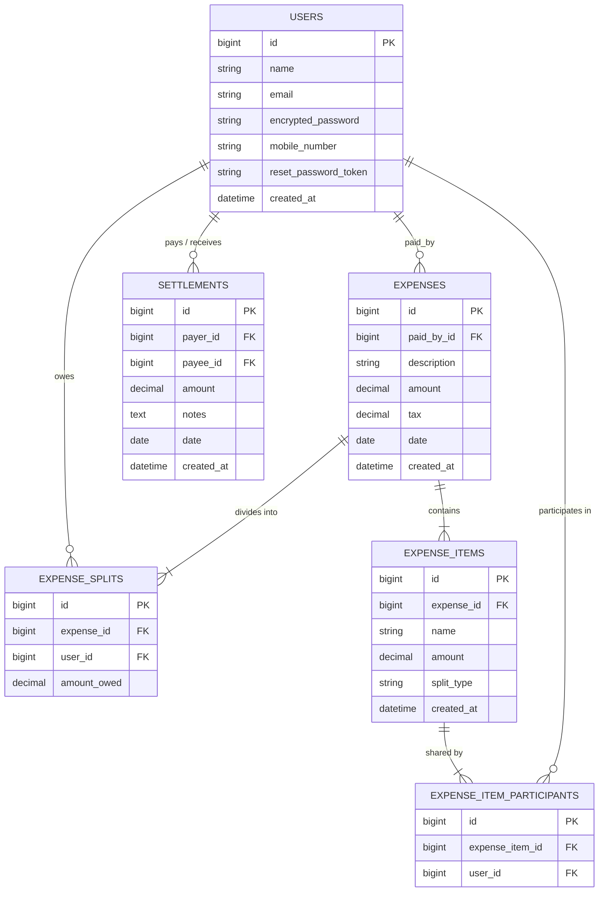

# 🧾 Splitwise Clone — Rails Expense Tracker

A full-featured **Splitwise Clone** built with **Ruby on Rails 8**, featuring itemized bill splitting, tax distribution, real-time debt calculation, balance ledgers, peer-to-peer settlements, and account authentication.

---

## 📑 Table of Contents

- [🌟 Features Implemented](#-features-implemented)
- [🗄️ Database Schema & Architecture](#️-database-schema--architecture)
- [⚙️ Prerequisites & Dependencies](#️-prerequisites--dependencies)
- [🚀 How to Run Locally (Manual Setup)](#-how-to-run-locally-manual-setup)
- [🐳 How to Run with Docker & Docker Compose](#-how-to-run-with-docker--docker-compose)
- [🧪 Running the Test Suite](#-running-the-test-suite)
- [☁️ Free Cloud Deployment (Render)](#️-free-cloud-deployment-render)

---

## 🌟 Features Implemented

### 1. Itemized Bill Creation & Splitting
- **Multiple Line Items:** Add one or multiple items per bill with dynamic row addition/removal in the UI.
- **Individual & Shared Item Splitting:** Assign an item directly to a single person (e.g., *User A had juice*), or split it equally among multiple selected participants (e.g., *Main dish shared between John and Alice*).
- **Tax Distribution:** Enter a bill tax amount which automatically distributes equally across all distinct participants on the bill.
- **Cent Rounding Algorithm:** Remainder fractional cents are distributed deterministically so the sum of individual splits matches the total bill exact to the penny.

### 2. Live Dashboard (`/`)
- **Total Balance Formula:** `(Amount due to you) - (Amount you owe)`. Displays in **green** (`+ $X.XX`) when positive or **red** (`- $X.XX`) when negative.
- **Summary Cards:** Shows **Total You Owe** and **Total Due to You**.
- **Detailed 2-Column Breakdown:**
  - **YOU OWE:** Lists friends you owe money to, with avatars and exact amounts.
  - **YOU ARE OWED:** Lists friends who owe you money, with avatars and exact amounts.
- **Sidebar & Live Friend Search:** Displays all friends with current net balances and an instant real-time search filter.

### 3. Friend Expenses Page (`/people/:id`)
- Displays all shared expenses involving you and that specific friend.
- Shows who paid the bill, who owes/lent money, the itemized breakdown, and date.
- **Delete Expense:** Ability to delete/cancel any expense, which automatically restores everyone's balances.

### 4. Settling Up (Payment Settlement)
- Record direct payments to friends you owe (or receive payments).
- Choose the friend, amount paid, payment date, and optional notes (e.g., *Cash, Venmo, UPI*).
- Automatically reduces outstanding debt between both users on their dashboards.

### 5. Authentication & Account Management
- **Splitwise UI Theme:** Redesigned Sign In and Sign Up pages with Splitwise branding (`#1CC29F` teal).
- **Sign Up:** Supports Full Name, Email, Mobile Number, and Password.
- **Forgot Password:** Password reset flow via ActionMailer with secure token generation.

---

## 🗄️ Database Schema & Architecture

### Entity-Relationship (ER) Diagram



### Architectural Principles
- **Fat Model, Skinny Controller:** All financial calculations, tax distributions, debt reconciliations, and balance aggregations reside within ActiveRecord models (`User`, `Expense`, `Settlement`).
- **Immutable Ledger Record:** `ExpenseSplit` records store the exact computed debt per user, ensuring high-performance balance lookups and tamper-proof history.

---

## ⚙️ Prerequisites & Dependencies

| Tool / Dependency | Version / Requirement |
| :--- | :--- |
| **Ruby** | `4.0.2` (or `>= 3.0.0`) |
| **Rails** | `8.1.2` |
| **PostgreSQL** | `>= 14` |
| **Bundler** | `>= 2.4.x` / `4.0.x` |
| **Node.js** | `>= 12.x` (Optional for local assets) |
| **Docker & Compose** | Docker Engine & Compose v1.13+ / v2.x |

---

## 🚀 How to Run Locally (Manual Setup)

### 1. Clone the Repository
```bash
git clone <repository-url>
cd humza
git checkout feature/splitwise-expenses
```

### 2. Configure Database Connection
Copy the sample database configuration or update [`config/database.yml`](file:///usr/local/google/home/mhumza/humza/config/database.yml):
```bash
cp config/database.yml.sample config/database.yml
```
Ensure PostgreSQL is running and your credentials (`username`, `password`, `port`) match your local environment.

### 3. Install Ruby Gems
```bash
bundle install
```

### 4. Setup Database & Seed Initial Users
```bash
bin/rails db:create db:migrate db:seed
```

### 5. Start the Rails Server
```bash
bin/rails server
```
Open **[http://localhost:3000](http://localhost:3000)** in your browser.

### 🔑 Demo Login Credentials
* **Email:** `john@example.com`
* **Password:** `password123`
*(Or create a new account via the **Sign up for Splitwise** button)*

---

## 🐳 How to Run with Docker & Docker Compose

To run the entire stack (PostgreSQL + Rails Web App) in isolated containers without installing Ruby or PostgreSQL locally:

```bash
# 1. Build and start containers
docker-compose up --build

# 2. Access the application
http://localhost:3000
```

> **Note:** The [`bin/docker-entrypoint`](file:///usr/local/google/home/mhumza/humza/bin/docker-entrypoint) script automatically prepares the database (`db:prepare`) on initial launch.

---

## 🧪 Running the Test Suite

The project includes automated test coverage with **RSpec** and **Minitest**:

### Run RSpec Specs (Recommended)
```bash
bin/rspec
```
**Coverage Highlights:**
* Itemized bill calculations with individual and shared items.
* Tax distribution and fractional remainder cent allocation.
* Multi-user balance calculations and dashboard summaries (`User#dashboard_summary`).
* Settlements and debt reduction (`Settlement`).
* Controller and request flows (`Expenses`, `Settlements`, `StaticPages`, `Passwords`).

### Run Minitest
```bash
bin/rails test
```

---
